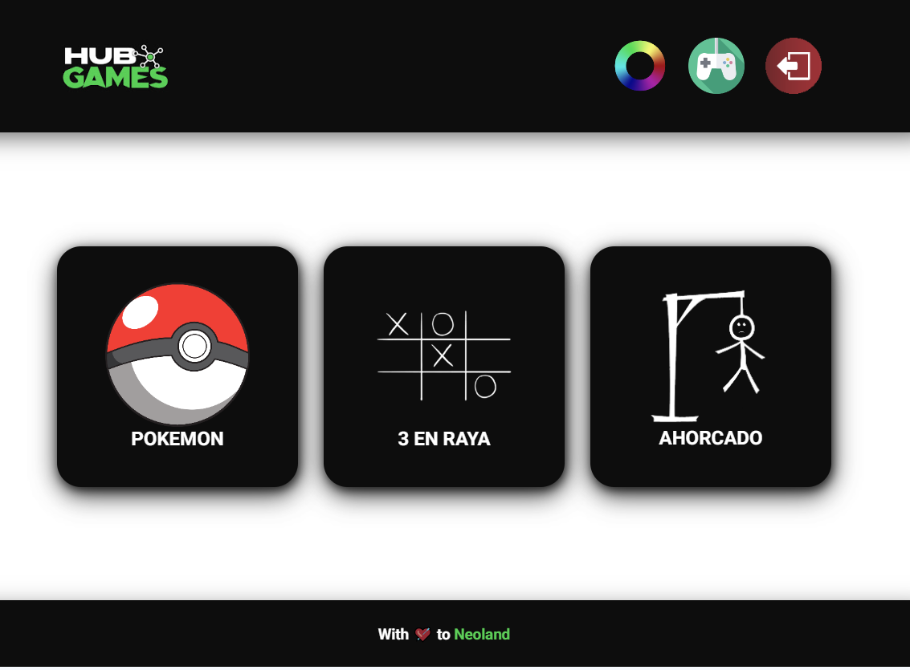

<h1 align="center">
    GAMES HUB
</h1>

<h1 align="center">

  </h1>

<h3 align="center">
    <a href="https://games-hub-ju.netlify.app/">Access demo page</a>
<h3 >

# Index

- [About](#-about)
- [Technologies used](#-technologies-used)
- [How to download the project](#-how-to-download-the-project)

## 🔖&nbsp; About

The GAMES HUB is a project created to be a platform with games and pokedex. It is a project created in order to practice in Neoland Bootcamp.

---

## 🚀 Technologies used

The project was developed using the following technologies

- Semantic HTML5 markup
- CSS Modules
- JavaScript
- Mobile-first workflow
- VS Code

---

## 🗂 How to install and run the project

    - Clone the repository
    - Enter directory
    - Install dependencies - run 'npm install'
    - Start project - 'npm run dev'

---

Developed ❤ by Juliana Fernandez
